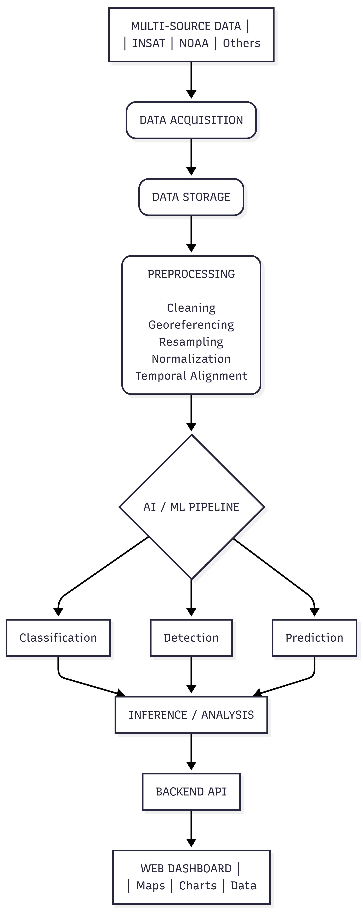
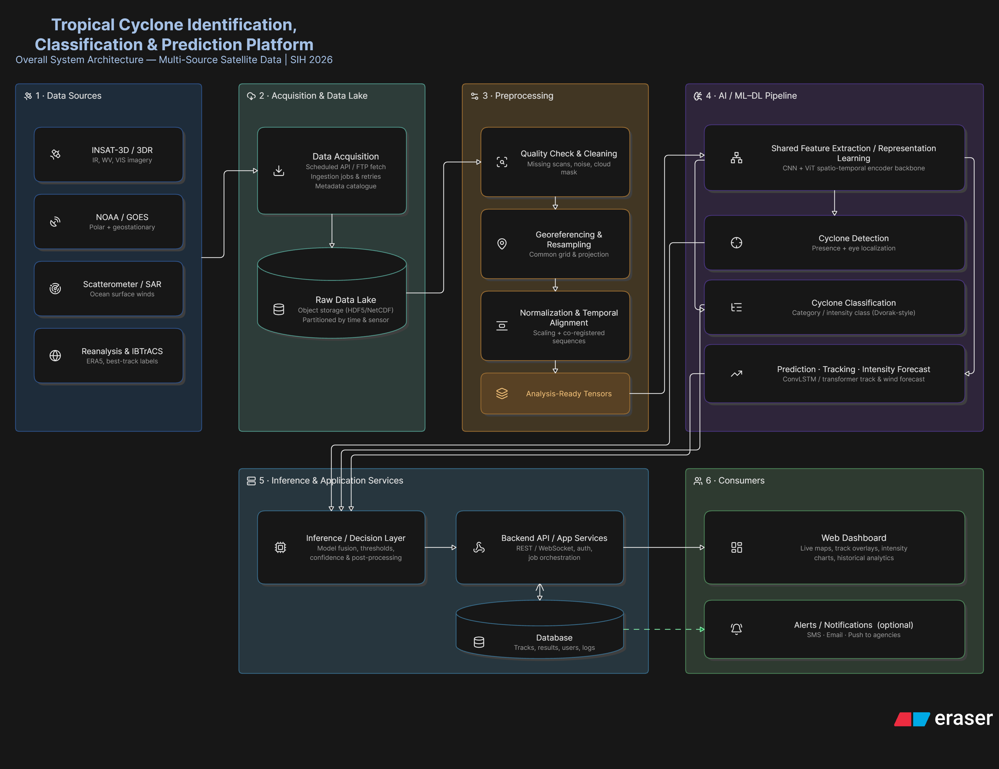
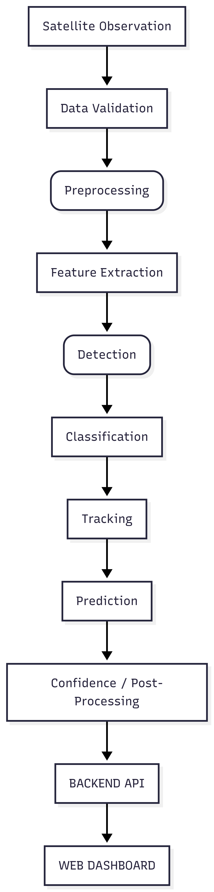

# VayuDrishti
### AI/ML-Based Tropical Cyclone Identification, Classification & Prediction System

> **Smart India Hackathon 2026 — Problem Statement: SIH26070**

VayuDrishti is an Artificial Intelligence and Machine Learning based platform designed to analyze **multi-source satellite data** for the identification, classification, tracking, and prediction of tropical cyclone patterns.

The system aims to transform large volumes of satellite observations into meaningful cyclone intelligence through an end-to-end pipeline covering **data acquisition, preprocessing, AI/ML analysis, prediction, backend services, and an interactive visualization dashboard**.

---

## Table of Contents

- [About VayuDrishti](#-about-vayudrishti)
- [Problem Statement](#-problem-statement)
- [Problem Overview](#-problem-overview)
- [Our Solution](#-our-solution)
- [Key Objectives](#-key-objectives)
- [Key Features](#-key-features)
- [System Architecture](#-system-architecture)
- [Overall Workflow](#-overall-workflow)
- [Data Sources](#-data-sources)
- [Technology Stack](#-technology-stack)
- [Machine Learning](#-machine-learning)
- [Database](#-database)
- [Model Inference Workflow](#model-inference-workflow)
- [Future Scope](#-future-scope)
- [Team](#-team)
- [Contribution](#-contribution)
- [License](#-license)

---

# About VayuDrishti

Tropical cyclones are among the most destructive natural hazards, capable of causing severe impacts on human life, infrastructure, agriculture, coastal regions, and ecosystems.

Timely identification and accurate prediction of cyclone development, movement, and intensity are therefore important for disaster management, emergency response, coastal safety, and risk assessment.

Modern Earth-observation satellites continuously generate large amounts of atmospheric and surface data. However, extracting useful information from this data at scale is challenging because satellite observations can differ in:

- Spatial resolution
- Temporal resolution
- Spectral characteristics
- Data format
- Geographic coverage
- Observation frequency

**VayuDrishti** aims to address this challenge by developing an AI/ML-powered pipeline capable of processing multi-source satellite observations and extracting cyclone-related information automatically.

The platform combines:

```text
Satellite Data
      ↓
Data Acquisition
      ↓
Data Processing
      ↓
AI / ML Analysis
      ↓
Detection
      ↓
Classification
      ↓
Tracking & Prediction
      ↓
Backend Services
      ↓
Interactive Dashboard
```
# Problem Statement
Develop an Artificial Intelligence (AI) / Machine Learning (ML) based system for identification, classification, and prediction of different tropical cyclone patterns using multi-source satellite data.

**Core Challenge**

The objective is to develop an intelligent system that can process satellite observations from multiple sources and use AI/ML techniques to:

- Identify tropical cyclone formations
- Recognize cyclone-related patterns
- Classify detected cyclone systems
- Track cyclone movement
- Predict future cyclone trajectory
- Analyze intensity-related characteristics
- Present the results through an accessible visualization platform


# Problem Overview

**Why is this problem challenging?**
1. Large Volumes of Satellite Data

Satellite platforms continuously generate huge quantities of Earth-observation data.

Manual inspection of this data can be:

- Time-consuming
- Difficult to scale
- Dependent on expert interpretation
- Computationally expensive

2. Multi-Source Data

Different satellites provide different types of observations.

These may include:

- Visible imagery
- Infrared imagery
- Water-vapor imagery
- Microwave observations
- Ocean observations
- Atmospheric observations

Combining these heterogeneous observations into a unified pipeline presents a significant data-engineering challenge.

3. Cyclone Identification

A tropical disturbance must be distinguished from other atmospheric systems.

The system should learn visual and spatial patterns associated with cyclone formation and identify potential cyclone systems automatically.

4. Cyclone Classification

Cyclones can exhibit different structural characteristics and intensity levels.

An AI/ML model can assist in classifying detected cyclone systems according to learned patterns and available ground-truth categories.

5. Cyclone Tracking

Cyclones evolve continuously over time.

Successive satellite observations can be used to estimate the movement of a cyclone and generate its historical track.

6. Cyclone Prediction

Prediction requires understanding both the current state and historical evolution of the cyclone.

Potential prediction targets include:

- Future latitude
- Future longitude
- Direction of movement
- Intensity
- Wind speed
- Central pressure

# Our Solution
VayuDrishti proposes an end-to-end AI/ML pipeline for tropical cyclone analysis.

# Key Objectives
1. Multi-Source Data Integration

Integrate satellite observations from multiple publicly available sources into a unified data pipeline.

2. Automated Data Preprocessing

Clean, normalize, align, and transform raw satellite observations into machine-learning-ready datasets.

3. Cyclone Identification

Automatically identify cyclone formations and cyclone-like patterns from satellite imagery.

4. Cyclone Classification

Classify detected cyclones according to relevant structural and intensity characteristics.

5. Cyclone Tracking

Track cyclone movement across successive satellite observations.

6. Cyclone Prediction

Predict future cyclone trajectory and potentially intensity-related parameters using temporal AI/ML models.

7. Visualization

Provide cyclone information through an interactive web dashboard.

8. Decision Support

Provide useful cyclone information that can assist disaster-management and monitoring activities.

# Key Features
**Multi-Source Satellite Data**

Support multiple satellite and auxiliary data sources through a unified processing pipeline.

**AI-Based Cyclone Detection**

Automatically identify potential cyclone systems from satellite observations.

**Cyclone Classification**

Classify detected systems according to learned cyclone patterns and available intensity categories.

**Cyclone Tracking**

Track cyclone movement using sequential satellite observations.

**Future Position Prediction**

Estimate the future trajectory of a cyclone using historical and current observations.

**Intensity Analysis**

Analyze cyclone intensity-related characteristics and provide predictions where supported by the trained model.

**Interactive Map**

The dashboard can display:

- Current cyclone position
- Historical trajectory
- Predicted trajectory
- Intensity information
- Geographic coordinates
- bservation timestamps

**Analytics Dashboard**

The dashboard can provide:

- Cyclone statistics
- Historical cyclone information
- Model predictions
- Confidence scores
- Time-series information
- Satellite imagery
**Alert System**

The platform can be extended to generate alerts when potentially significant cyclone conditions are detected or predicted.

Potential notification channels:

- Web notifications
- Email
- SMS
- Push notificatio

# System Architecture


# Overaall WorkFlow

**Data Collection**

Satellite observations are collected from available data providers.

Satellite Sources | APIs / Downloads | Raw Satellite Observations

**Data Storage**

Collected data is stored in a structured storage system.

Raw Data | Data Lake / Object Storage | Metadata Catalogue

**Data Preprocessing**

Raw satellite data is transformed into analysis-ready data.

Potential preprocessing operations include:

- Data validation
- Missing-data handling
- Noise reduction
- Cloud masking where applicable
- Georeferencing
- Spatial resampling
- Normalization
- Temporal alignment
- Image cropping
- Data augmentation

**Feature Extraction**

Relevant spatial and temporal features are extracted from satellite observations.

Possible approaches include:

- CNN-based feature extraction
- ision Transformers
- Spatio-temporal encoders
- Multi-channel image representations

**Cyclone Detection**

The model determines whether a cyclone or cyclone-like system is present.

Satellite Image
      ↓
Feature Extraction
      ↓
Detection Model
      ↓
Cyclone / No Cyclone

The detection stage may additionally provide:

- Location
- Bounding region
- Confidence score

**Cyclone Classification**

Once a cyclone is detected, the system analyzes its characteristics.

Detected Cyclone -> Classification Model -> Cyclone Category / PatConfidence Score

**Cyclone Tracking**

Successive observations are used to estimate cyclone movement.

t₁ → t₂ → t₃ → t₄
 ↓    ↓    ↓    ↓
 P₁   P₂   P₃   P₄

The detected positions can be connected to generate a historical cyclone trajectory.

**Cyclone Prediction**

Historical and current observations can be provided to a temporal forecasting model.

Historical Observations -> Temporal Feature Extraction -> Prediction Model -> Future Cyclone State

Potential outputs include:

- Future latitude
- Future longitude
- Direction
- Intensity
- Wind speed
- Central pressure

**Backend Processing**

The backend acts as the communication layer between the frontend, database, and AI/ML services.

ML Models -> Inference Service -> Backend API -> Frontend

**Visualization**

The frontend presents the model results through an interactive dashboard.

The dashboard can display:

- Cyclone location
- Historical track
- Predicted path
- Classification
- Intensity
- Satellite imagery
- Confidence scores
- Historical information

# Data Sources

VayuDrishti is designed around multi-source satellite observations.

The exact datasets will be finalized after evaluating their availability, resolution, temporal coverage, licensing, and suitability for model training.

**INSAT**

Indian geostationary satellite observations can provide valuable information for monitoring weather systems over the Indian region.

Potential observations include:

- Visible imagery
- Infrared imagery
- Water-vapor imagery
- Atmospheric information

**NOAA**

NOAA provides access to various meteorological and satellite datasets.

Potentially useful observations include:

- Geostationary satellite observations
- Polar-orbiting satellite observations
- Ocean observations
- Meteorological datasets

**Other Satellite Sources**

Depending on availability and licensing, additional Earth-observation sources may be considered, including:

- NASA datasets
- EUMETSAT datasets
- Copernicus / Sentinel datasets
- Other publicly available Earth-observation datasets

**Auxiliary Data**

Satellite imagery may be complemented with:

- ERA5 / reanalysis data
- Historical cyclone tracks
- Best-track datasets
- Wind information
- Atmospheric pressure
- Sea-surface temperature

# Technology Stack

**Frontend**

Potential technologies:

- React.js / Next.js
- JavaScript / TypeScript
- Tailwind CSS
- Leaflet / Mapbox
- Recharts / Plotly

**Backend**

Potential technologies:

- Python
- FastAPI
- REST APIs
- WebSockets

**Machine Learning**

Potential technologies:

- Python
- PyTorch
- TensorFlow / Keras
- NumPy
- Pandas
- OpenCV
- Scikit-learn
- Xarray
- Rasterio
- GDAL

**Database**

Potential technologies:

- PostgreSQL
- Redis

**Data Storage**

Potential options:

- Local storage during development
- AWS S3
- Google Cloud Storage

**DevOps**

Potential tools:

- Git
- GitHub
- Docker
- GitHub Actions
- Cloud deployment

# Development
The database will maintain structured application, cyclone, observation, and prediction information.

Potential cyclone attributes include:

- Cyclone ID
- Name
- Timestamp
- Latitude
- Longitude
- Intensity
- Wind speed
- Pressure
- Classification
- Model confidence

# Model Inference Workflow



# Future Scope

**More Data Source**
Integrate additional satellite and meteorological datasets to improve the diversity of observations.

**Advanced AI Models**

Future versions may explore:

- Vision Transformers
- Spatio-temporal Transformers
- Multimodal models
- Ensemble learning
- Self-supervised learning

**Ocean Parameters**

Additional environmental variables could be incorporated, such as:

- Sea Surface Temperature
- Ocean heat content
- Wind fields
- Atmospheric pressure
- Humidity

**Near Real-Time Monitoring**

Develop automated ingestion pipelines for continuously updated satellite observations.


**Early Warning**

Extend the platform with automated alert generation based on detected and predicted cyclone conditions.


**Mobile Application**

Develop a mobile application for field personnel, emergency responders, and other users.


**Decision Support**

Provide summarized cyclone intelligence that can assist disaster-management and monitoring organizations

# Team
Member	        Role

Yashaswini -> Project Lead | AI/ML

Raj -> Full Stack Web Developer and ML Model Trainer

Mankirat ->	Backend Development & ML Model Trainer

Arnav -> Databases and Data Management

Maulik ->	Research & Data Collection

Vedant ->	Documentation and UI/UX